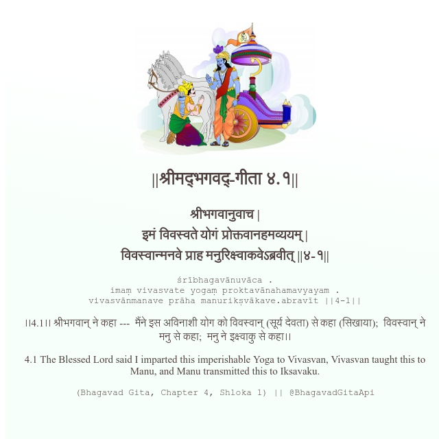

<h2>||श्रीमद्‍भगवद्‍-गीता ४.१||</h2>
<h3>श्रीभगवानुवाच | इमं विवस्वते योगं प्रोक्तवानहमव्ययम् | विवस्वान्मनवे प्राह मनुरिक्ष्वाकवेऽब्रवीत् ||४-१||</h3>
<pre>śrībhagavānuvāca . imaṃ vivasvate yogaṃ proktavānahamavyayam . vivasvānmanave prāha manurikṣvākave.abravīt ||4-1||</pre>

।।4.1।। श्रीभगवान् ने कहा ---  मैंने इस अविनाशी योग को विवस्वान् (सूर्य देवता) से कहा (सिखाया);  विवस्वान् ने मनु से कहा;  मनु ने इक्ष्वाकु से कहा।।

<pre>(Bhagavad Gita, Chapter 4, Shloka 1) || @BhagavadGitaApi</pre>
https://bhagavadgitaapi.in/

#API #bhagavadgitaapi #slok #nodejs #js #api #gitaapi #krishna #hinduism #vedic #ISKCON #shreemadbhagavadgita #technology

