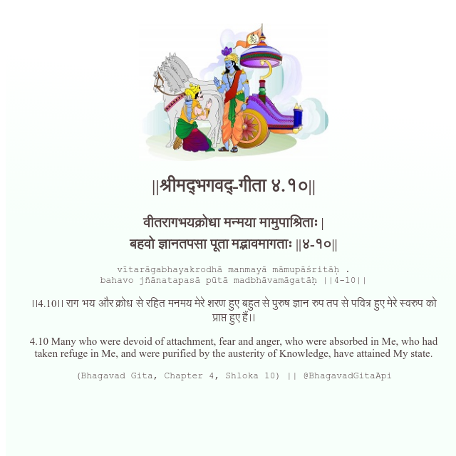

<h2>||श्रीमद्‍भगवद्‍-गीता ४.१०||</h2>
<h3>वीतरागभयक्रोधा मन्मया मामुपाश्रिताः | बहवो ज्ञानतपसा पूता मद्भावमागताः ||४-१०||</h3>
<pre>vītarāgabhayakrodhā manmayā māmupāśritāḥ . bahavo jñānatapasā pūtā madbhāvamāgatāḥ ||4-10||</pre>

।।4.10।। राग भय और क्रोध से रहित मनमय मेरे शरण हुए बहुत से पुरुष ज्ञान रुप तप से पवित्र‌ हुए मेरे स्वरुप को प्राप्त हुए हैं।।

<pre>(Bhagavad Gita, Chapter 4, Shloka 10) || @BhagavadGitaApi</pre>
https://docs.bhagavadgitaapi.in/

#API #bhagavadgitaapi #slok #nodejs #js #api #gitaapi #krishna #hinduism #vedic #ISKCON #shreemadbhagavadgita #technology

