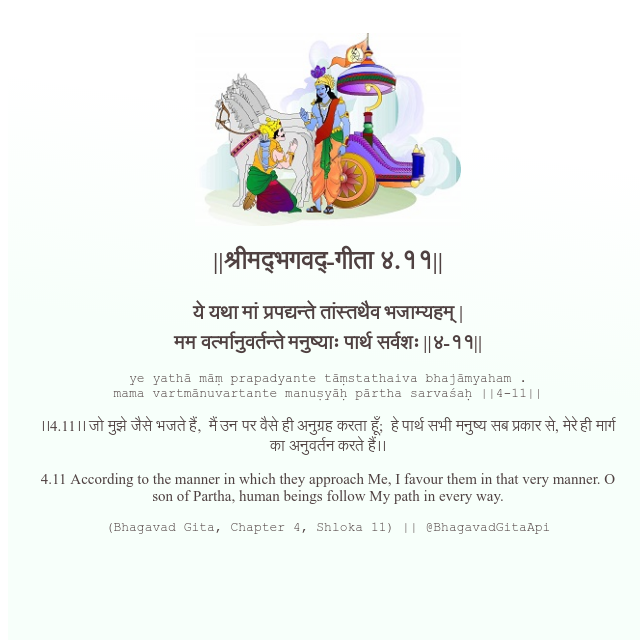

<h2>||श्रीमद्‍भगवद्‍-गीता ४.११||</h2>
<h3>ये यथा मां प्रपद्यन्ते तांस्तथैव भजाम्यहम् | मम वर्त्मानुवर्तन्ते मनुष्याः पार्थ सर्वशः ||४-११||</h3>
<pre>ye yathā māṃ prapadyante tāṃstathaiva bhajāmyaham . mama vartmānuvartante manuṣyāḥ pārtha sarvaśaḥ ||4-11||</pre>

।।4.11।। जो मुझे जैसे भजते हैं,  मैं उन पर वैसे ही अनुग्रह करता हूँ;  हे पार्थ सभी मनुष्य सब प्रकार से, मेरे ही मार्ग का अनुवर्तन करते हैं।।

<pre>(Bhagavad Gita, Chapter 4, Shloka 11) || @BhagavadGitaApi</pre>
https://vedicscriptures.github.io/

#API #bhagavadgitaapi #slok #nodejs #js #api #gitaapi #krishna #hinduism #vedic #ISKCON #shreemadbhagavadgita #technology

