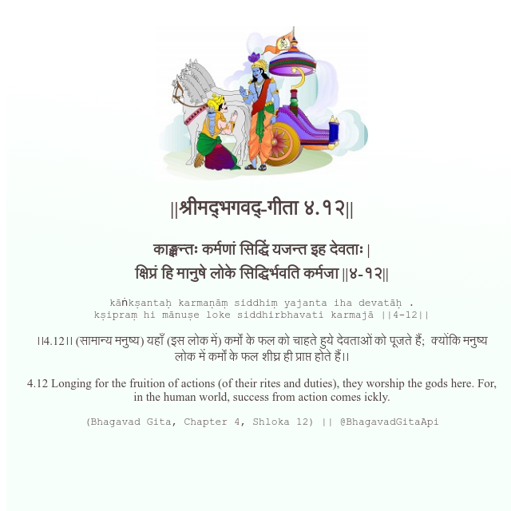

<h2>||श्रीमद्‍भगवद्‍-गीता ४.१२||</h2>
<h3>काङ्क्षन्तः कर्मणां सिद्धिं यजन्त इह देवताः | क्षिप्रं हि मानुषे लोके सिद्धिर्भवति कर्मजा ||४-१२||</h3>
<pre>kāṅkṣantaḥ karmaṇāṃ siddhiṃ yajanta iha devatāḥ . kṣipraṃ hi mānuṣe loke siddhirbhavati karmajā ||4-12||</pre>

।।4.12।। (सामान्य मनुष्य) यहाँ (इस लोक में) कर्मों के फल को चाहते हुये देवताओं को पूजते हैं;  क्योंकि मनुष्य लोक में कर्मों के फल शीघ्र ही प्राप्त होते हैं।।

<pre>(Bhagavad Gita, Chapter 4, Shloka 12) || @BhagavadGitaApi</pre>
https://docs.bhagavadgitaapi.in/

#API #bhagavadgitaapi #slok #nodejs #js #api #gitaapi #krishna #hinduism #vedic #ISKCON #shreemadbhagavadgita #technology

