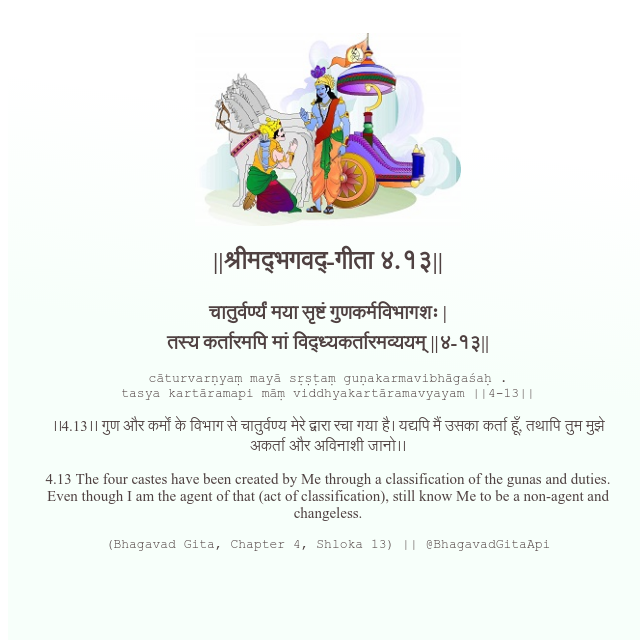

<h2>||श्रीमद्‍भगवद्‍-गीता ४.१३||</h2>
<h3>चातुर्वर्ण्यं मया सृष्टं गुणकर्मविभागशः | तस्य कर्तारमपि मां विद्ध्यकर्तारमव्ययम् ||४-१३||</h3>
<pre>cāturvarṇyaṃ mayā sṛṣṭaṃ guṇakarmavibhāgaśaḥ . tasya kartāramapi māṃ viddhyakartāramavyayam ||4-13||</pre>

।।4.13।। गुण और कर्मों के विभाग से चातुर्वण्य मेरे द्वारा रचा गया है। यद्यपि मैं उसका कर्ता हूँ, तथापि तुम मुझे अकर्ता और अविनाशी जानो।।

<pre>(Bhagavad Gita, Chapter 4, Shloka 13) || @BhagavadGitaApi</pre>
https://vedicscriptures.github.io/

#API #bhagavadgitaapi #slok #nodejs #js #api #gitaapi #krishna #hinduism #vedic #ISKCON #shreemadbhagavadgita #technology

