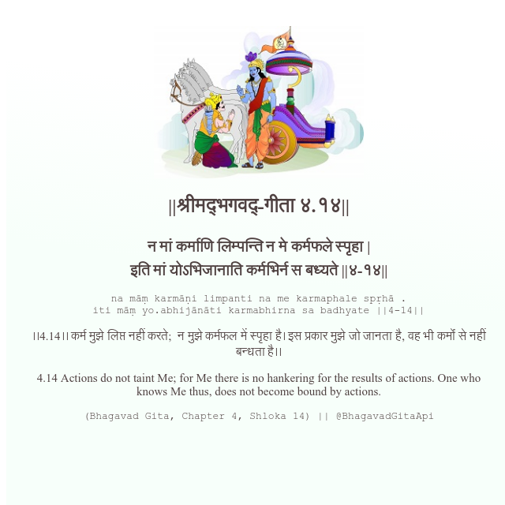

<h2>||श्रीमद्‍भगवद्‍-गीता ४.१४||</h2>
<h3>न मां कर्माणि लिम्पन्ति न मे कर्मफले स्पृहा | इति मां योऽभिजानाति कर्मभिर्न स बध्यते ||४-१४||</h3>
<pre>na māṃ karmāṇi limpanti na me karmaphale spṛhā . iti māṃ yo.abhijānāti karmabhirna sa badhyate ||4-14||</pre>

।।4.14।। कर्म मुझे लिप्त नहीं करते;  न मुझे कर्मफल में स्पृहा है। इस प्रकार मुझे जो जानता है, वह भी कर्मों से नहीं बन्धता है।।

<pre>(Bhagavad Gita, Chapter 4, Shloka 14) || @BhagavadGitaApi</pre>
https://docs.bhagavadgitaapi.in/

#API #bhagavadgitaapi #slok #nodejs #js #api #gitaapi #krishna #hinduism #vedic #ISKCON #shreemadbhagavadgita #technology

