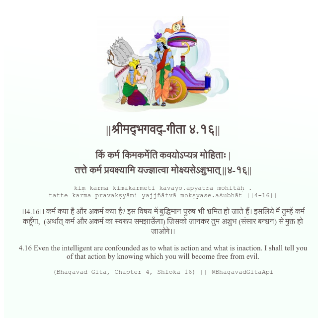

<h2>||श्रीमद्‍भगवद्‍-गीता ४.१६||</h2>
<h3>किं कर्म किमकर्मेति कवयोऽप्यत्र मोहिताः | तत्ते कर्म प्रवक्ष्यामि यज्ज्ञात्वा मोक्ष्यसेऽशुभात् ||४-१६||</h3>
<pre>kiṃ karma kimakarmeti kavayo.apyatra mohitāḥ . tatte karma pravakṣyāmi yajjñātvā mokṣyase.aśubhāt ||4-16||</pre>

।।4.16।। कर्म क्या है और अकर्म क्या है? इस विषय में बुद्धिमान पुरुष भी भ्रमित हो जाते हैं। इसलिये मैं तुम्हें कर्म कहूँगा,  (अर्थात् कर्म और अकर्म का स्वरूप समझाऊँगा) जिसको जानकर तुम अशुभ (संसार बन्धन) से मुक्त हो जाओगे।।

<pre>(Bhagavad Gita, Chapter 4, Shloka 16) || @BhagavadGitaApi</pre>
https://docs.bhagavadgitaapi.in/

#API #bhagavadgitaapi #slok #nodejs #js #api #gitaapi #krishna #hinduism #vedic #ISKCON #shreemadbhagavadgita #technology

