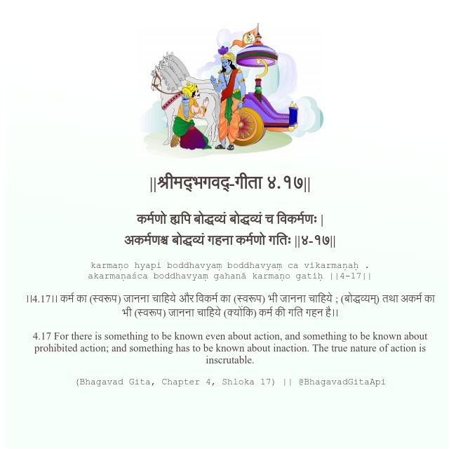

<h2>||श्रीमद्‍भगवद्‍-गीता ४.१७||</h2>
<h3>कर्मणो ह्यपि बोद्धव्यं बोद्धव्यं च विकर्मणः | अकर्मणश्च बोद्धव्यं गहना कर्मणो गतिः ||४-१७||</h3>
<pre>karmaṇo hyapi boddhavyaṃ boddhavyaṃ ca vikarmaṇaḥ . akarmaṇaśca boddhavyaṃ gahanā karmaṇo gatiḥ ||4-17||</pre>

।।4.17।। कर्म का (स्वरूप) जानना चाहिये और विकर्म का (स्वरूप) भी जानना चाहिये ; (बोद्धव्यम्) तथा अकर्म का भी (स्वरूप) जानना चाहिये (क्योंकि) कर्म की गति गहन है।।

<pre>(Bhagavad Gita, Chapter 4, Shloka 17) || @BhagavadGitaApi</pre>
https://bhagavadgitaapi.in/

#API #bhagavadgitaapi #slok #nodejs #js #api #gitaapi #krishna #hinduism #vedic #ISKCON #shreemadbhagavadgita #technology

