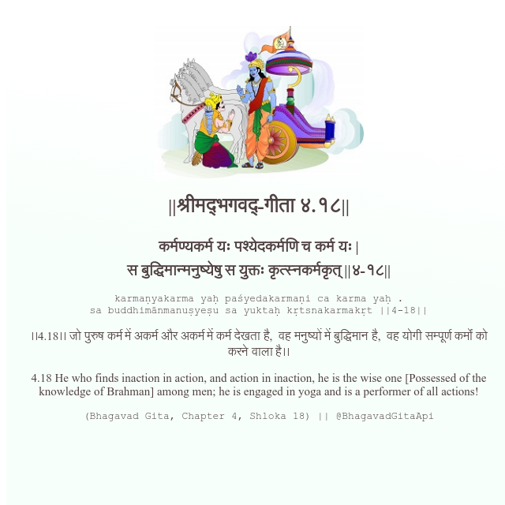

<h2>||श्रीमद्‍भगवद्‍-गीता ४.१८||</h2>
<h3>कर्मण्यकर्म यः पश्येदकर्मणि च कर्म यः | स बुद्धिमान्मनुष्येषु स युक्तः कृत्स्नकर्मकृत् ||४-१८||</h3>
<pre>karmaṇyakarma yaḥ paśyedakarmaṇi ca karma yaḥ . sa buddhimānmanuṣyeṣu sa yuktaḥ kṛtsnakarmakṛt ||4-18||</pre>

।।4.18।। जो पुरुष कर्म में अकर्म और अकर्म में कर्म देखता है,  वह मनुष्यों में बुद्धिमान है,  वह योगी सम्पूर्ण कर्मों को करने वाला है।।

<pre>(Bhagavad Gita, Chapter 4, Shloka 18) || @BhagavadGitaApi</pre>
https://bhagavadgitaapi.in/

#API #bhagavadgitaapi #slok #nodejs #js #api #gitaapi #krishna #hinduism #vedic #ISKCON #shreemadbhagavadgita #technology

