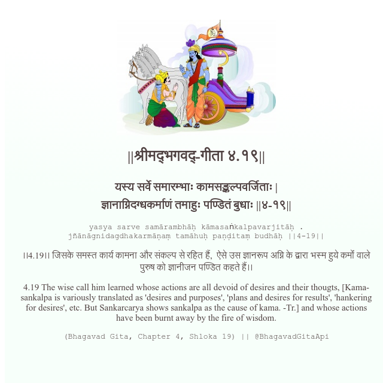

<h2>||श्रीमद्‍भगवद्‍-गीता ४.१९||</h2>
<h3>यस्य सर्वे समारम्भाः कामसङ्कल्पवर्जिताः | ज्ञानाग्निदग्धकर्माणं तमाहुः पण्डितं बुधाः ||४-१९||</h3>
<pre>yasya sarve samārambhāḥ kāmasaṅkalpavarjitāḥ . jñānāgnidagdhakarmāṇaṃ tamāhuḥ paṇḍitaṃ budhāḥ ||4-19||</pre>

।।4.19।। जिसके समस्त कार्य कामना और संकल्प से रहित हैं,  ऐसे उस ज्ञानरूप अग्नि के द्वारा भस्म हुये कर्मों वाले पुरुष को ज्ञानीजन पण्डित कहते हैं।।

<pre>(Bhagavad Gita, Chapter 4, Shloka 19) || @BhagavadGitaApi</pre>
https://docs.bhagavadgitaapi.in/

#API #bhagavadgitaapi #slok #nodejs #js #api #gitaapi #krishna #hinduism #vedic #ISKCON #shreemadbhagavadgita #technology

