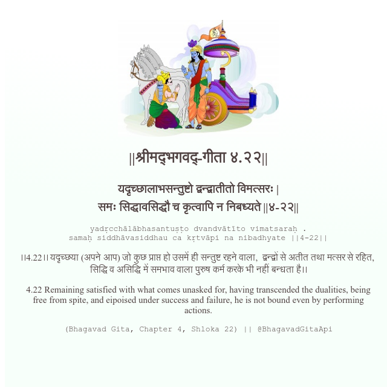

<h2>||श्रीमद्‍भगवद्‍-गीता ४.२२||</h2>
<h3>यदृच्छालाभसन्तुष्टो द्वन्द्वातीतो विमत्सरः | समः सिद्धावसिद्धौ च कृत्वापि न निबध्यते ||४-२२||</h3>
<pre>yadṛcchālābhasantuṣṭo dvandvātīto vimatsaraḥ . samaḥ siddhāvasiddhau ca kṛtvāpi na nibadhyate ||4-22||</pre>

।।4.22।। यदृच्छया (अपने आप) जो कुछ प्राप्त हो उसमें ही सन्तुष्ट रहने वाला,  द्वन्द्वों से अतीत तथा मत्सर से रहित,  सिद्धि व असिद्धि में समभाव वाला पुरुष कर्म करके भी नहीं बन्धता है।।

<pre>(Bhagavad Gita, Chapter 4, Shloka 22) || @BhagavadGitaApi</pre>
https://bhagavadgitaapi.in/

#API #bhagavadgitaapi #slok #nodejs #js #api #gitaapi #krishna #hinduism #vedic #ISKCON #shreemadbhagavadgita #technology

