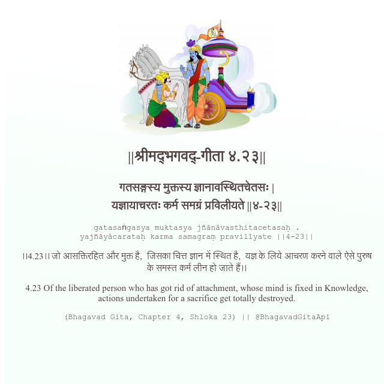

<h2>||श्रीमद्‍भगवद्‍-गीता ४.२३||</h2>
<h3>गतसङ्गस्य मुक्तस्य ज्ञानावस्थितचेतसः | यज्ञायाचरतः कर्म समग्रं प्रविलीयते ||४-२३||</h3>
<pre>gatasaṅgasya muktasya jñānāvasthitacetasaḥ . yajñāyācarataḥ karma samagraṃ pravilīyate ||4-23||</pre>

।।4.23।। जो आसक्तिरहित और मुक्त है,  जिसका चित्त ज्ञान में स्थित है,  यज्ञ के लिये आचरण करने वाले ऐसे पुरुष के समस्त कर्म लीन हो जाते हैं।।

<pre>(Bhagavad Gita, Chapter 4, Shloka 23) || @BhagavadGitaApi</pre>
https://docs.bhagavadgitaapi.in/

#API #bhagavadgitaapi #slok #nodejs #js #api #gitaapi #krishna #hinduism #vedic #ISKCON #shreemadbhagavadgita #technology

