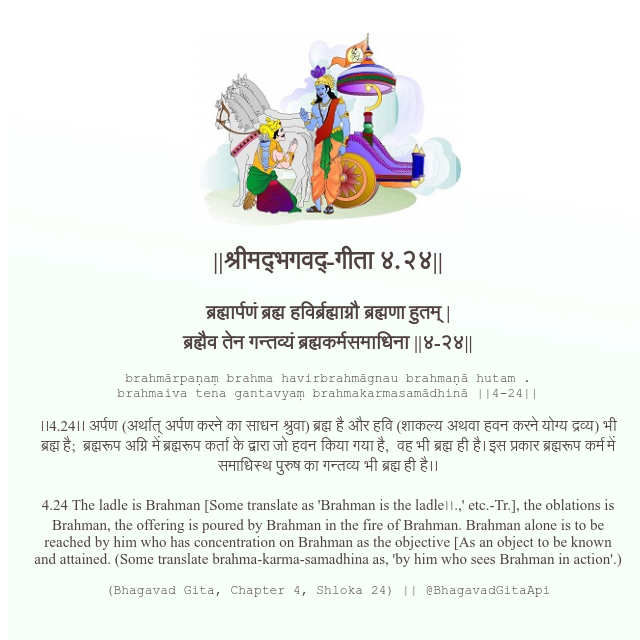

<h2>||श्रीमद्‍भगवद्‍-गीता ४.२४||</h2>
<h3>ब्रह्मार्पणं ब्रह्म हविर्ब्रह्माग्नौ ब्रह्मणा हुतम् | ब्रह्मैव तेन गन्तव्यं ब्रह्मकर्मसमाधिना ||४-२४||</h3>
<pre>brahmārpaṇaṃ brahma havirbrahmāgnau brahmaṇā hutam . brahmaiva tena gantavyaṃ brahmakarmasamādhinā ||4-24||</pre>

।।4.24।। अर्पण (अर्थात् अर्पण करने का साधन श्रुवा) ब्रह्म है और हवि (शाकल्य अथवा हवन करने योग्य द्रव्य) भी ब्रह्म है;  ब्रह्मरूप अग्नि में ब्रह्मरूप कर्ता के द्वारा जो हवन किया गया है,  वह भी ब्रह्म ही है। इस प्रकार ब्रह्मरूप कर्म में समाधिस्थ पुरुष का गन्तव्य भी ब्रह्म ही है।।

<pre>(Bhagavad Gita, Chapter 4, Shloka 24) || @BhagavadGitaApi</pre>
https://docs.bhagavadgitaapi.in/

#API #bhagavadgitaapi #slok #nodejs #js #api #gitaapi #krishna #hinduism #vedic #ISKCON #shreemadbhagavadgita #technology

