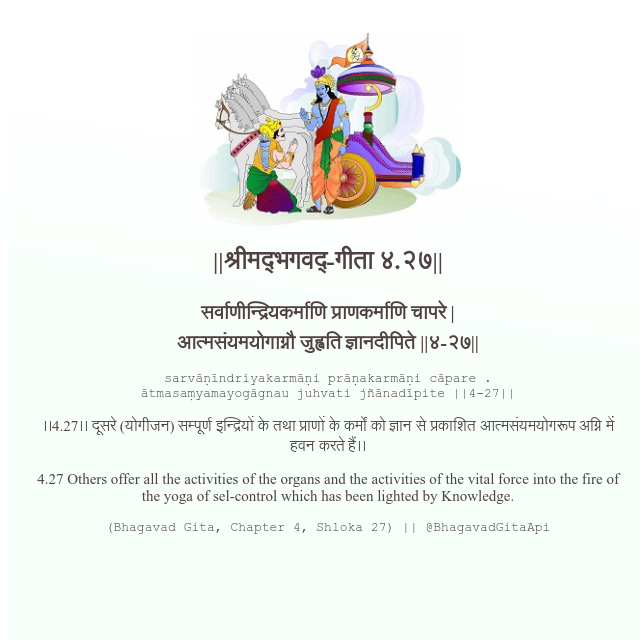

<h2>||श्रीमद्‍भगवद्‍-गीता ४.२७||</h2>
<h3>सर्वाणीन्द्रियकर्माणि प्राणकर्माणि चापरे | आत्मसंयमयोगाग्नौ जुह्वति ज्ञानदीपिते ||४-२७||</h3>
<pre>sarvāṇīndriyakarmāṇi prāṇakarmāṇi cāpare . ātmasaṃyamayogāgnau juhvati jñānadīpite ||4-27||</pre>

।।4.27।। दूसरे (योगीजन) सम्पूर्ण इन्द्रियों के तथा प्राणों के कर्मों को ज्ञान से प्रकाशित आत्मसंयमयोगरूप अग्नि में हवन करते हैं।।

<pre>(Bhagavad Gita, Chapter 4, Shloka 27) || @BhagavadGitaApi</pre>
https://vedicscriptures.github.io/

#API #bhagavadgitaapi #slok #nodejs #js #api #gitaapi #krishna #hinduism #vedic #ISKCON #shreemadbhagavadgita #technology

