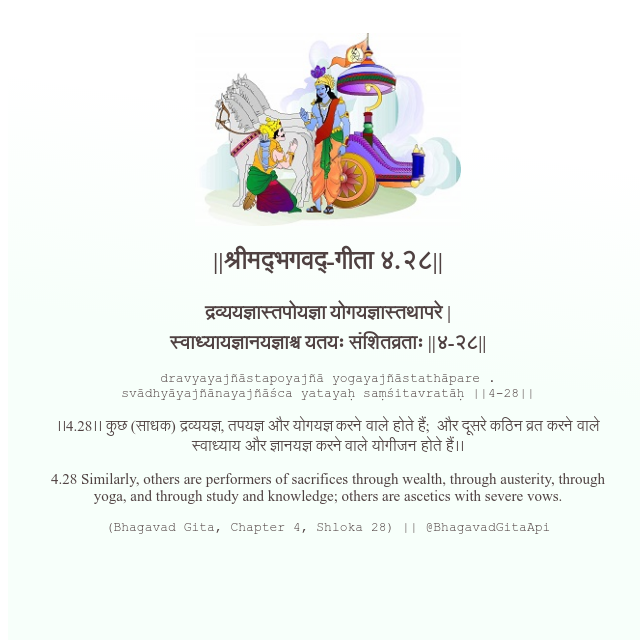

<h2>||श्रीमद्‍भगवद्‍-गीता ४.२८||</h2>
<h3>द्रव्ययज्ञास्तपोयज्ञा योगयज्ञास्तथापरे | स्वाध्यायज्ञानयज्ञाश्च यतयः संशितव्रताः ||४-२८||</h3>
<pre>dravyayajñāstapoyajñā yogayajñāstathāpare . svādhyāyajñānayajñāśca yatayaḥ saṃśitavratāḥ ||4-28||</pre>

।।4.28।। कुछ (साधक) द्रव्ययज्ञ, तपयज्ञ और योगयज्ञ करने वाले होते हैं;  और दूसरे कठिन व्रत करने वाले स्वाध्याय और ज्ञानयज्ञ करने वाले योगीजन होते हैं।।

<pre>(Bhagavad Gita, Chapter 4, Shloka 28) || @BhagavadGitaApi</pre>
https://docs.bhagavadgitaapi.in/

#API #bhagavadgitaapi #slok #nodejs #js #api #gitaapi #krishna #hinduism #vedic #ISKCON #shreemadbhagavadgita #technology

