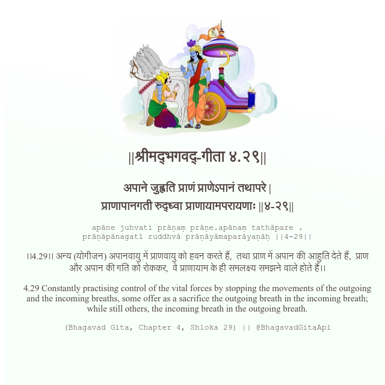

<h2>||श्रीमद्‍भगवद्‍-गीता ४.२९||</h2>
<h3>अपाने जुह्वति प्राणं प्राणेऽपानं तथापरे | प्राणापानगती रुद्ध्वा प्राणायामपरायणाः ||४-२९||</h3>
<pre>apāne juhvati prāṇaṃ prāṇe.apānaṃ tathāpare . prāṇāpānagatī ruddhvā prāṇāyāmaparāyaṇāḥ ||4-29||</pre>

।।4.29।। अन्य (योगीजन) अपानवायु में प्राणवायु को हवन करते हैं,  तथा प्राण में अपान की आहुति देते हैं,  प्राण और अपान की गति को रोककर,  वे प्राणायाम के ही समलक्ष्य समझने वाले होते हैं।।

<pre>(Bhagavad Gita, Chapter 4, Shloka 29) || @BhagavadGitaApi</pre>
https://docs.bhagavadgitaapi.in/

#API #bhagavadgitaapi #slok #nodejs #js #api #gitaapi #krishna #hinduism #vedic #ISKCON #shreemadbhagavadgita #technology

