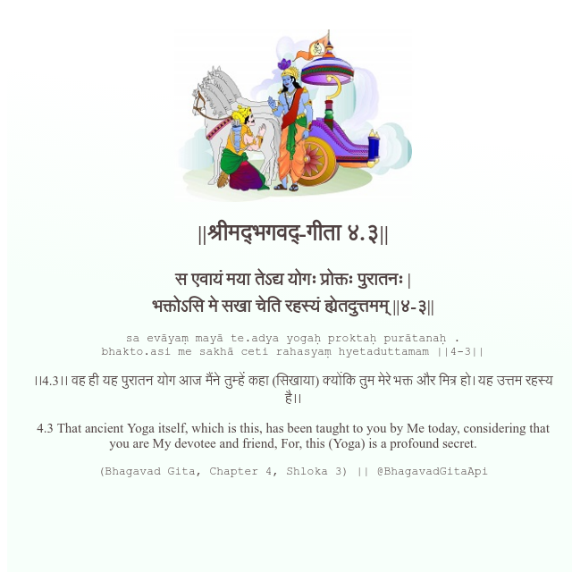

<h2>||श्रीमद्‍भगवद्‍-गीता ४.३||</h2>
<h3>स एवायं मया तेऽद्य योगः प्रोक्तः पुरातनः | भक्तोऽसि मे सखा चेति रहस्यं ह्येतदुत्तमम् ||४-३||</h3>
<pre>sa evāyaṃ mayā te.adya yogaḥ proktaḥ purātanaḥ . bhakto.asi me sakhā ceti rahasyaṃ hyetaduttamam ||4-3||</pre>

।।4.3।। वह ही यह पुरातन योग आज मैंने तुम्हें कहा (सिखाया) क्योंकि तुम मेरे भक्त और मित्र हो। यह उत्तम रहस्य है।।

<pre>(Bhagavad Gita, Chapter 4, Shloka 3) || @BhagavadGitaApi</pre>
https://docs.bhagavadgitaapi.in/

#API #bhagavadgitaapi #slok #nodejs #js #api #gitaapi #krishna #hinduism #vedic #ISKCON #shreemadbhagavadgita #technology

