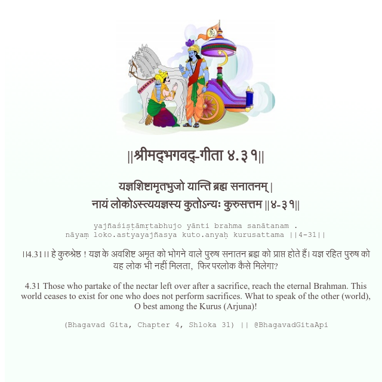

<h2>||श्रीमद्‍भगवद्‍-गीता ४.३१||</h2>
<h3>यज्ञशिष्टामृतभुजो यान्ति ब्रह्म सनातनम् | नायं लोकोऽस्त्ययज्ञस्य कुतोऽन्यः कुरुसत्तम ||४-३१||</h3>
<pre>yajñaśiṣṭāmṛtabhujo yānti brahma sanātanam . nāyaṃ loko.astyayajñasya kuto.anyaḥ kurusattama ||4-31||</pre>

।।4.31।। हे कुरुश्रेष्ठ ! यज्ञ के अवशिष्ट अमृत को भोगने वाले पुरुष सनातन ब्रह्म को प्राप्त होते हैं। यज्ञ रहित पुरुष को यह लोक भी नहीं मिलता,  फिर परलोक कैसे मिलेगा?

<pre>(Bhagavad Gita, Chapter 4, Shloka 31) || @BhagavadGitaApi</pre>
https://bhagavadgitaapi.in/

#API #bhagavadgitaapi #slok #nodejs #js #api #gitaapi #krishna #hinduism #vedic #ISKCON #shreemadbhagavadgita #technology

