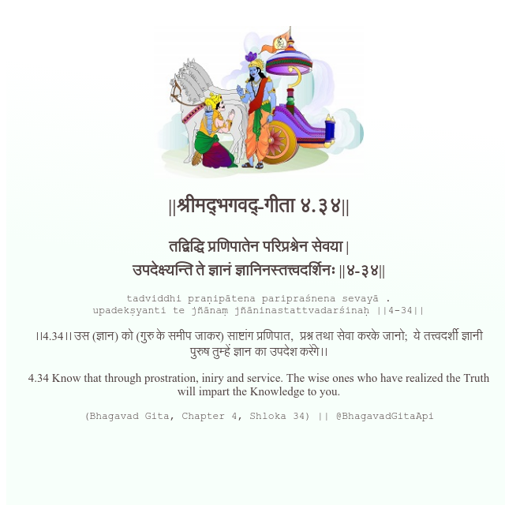

<h2>||श्रीमद्‍भगवद्‍-गीता ४.३४||</h2>
<h3>तद्विद्धि प्रणिपातेन परिप्रश्नेन सेवया | उपदेक्ष्यन्ति ते ज्ञानं ज्ञानिनस्तत्त्वदर्शिनः ||४-३४||</h3>
<pre>tadviddhi praṇipātena paripraśnena sevayā . upadekṣyanti te jñānaṃ jñāninastattvadarśinaḥ ||4-34||</pre>

।।4.34।। उस (ज्ञान) को (गुरु के समीप जाकर) साष्टांग प्रणिपात,  प्रश्न तथा सेवा करके जानो;  ये तत्त्वदर्शी ज्ञानी पुरुष तुम्हें ज्ञान का उपदेश करेंगे।।

<pre>(Bhagavad Gita, Chapter 4, Shloka 34) || @BhagavadGitaApi</pre>
https://bhagavadgitaapi.in/

#API #bhagavadgitaapi #slok #nodejs #js #api #gitaapi #krishna #hinduism #vedic #ISKCON #shreemadbhagavadgita #technology

