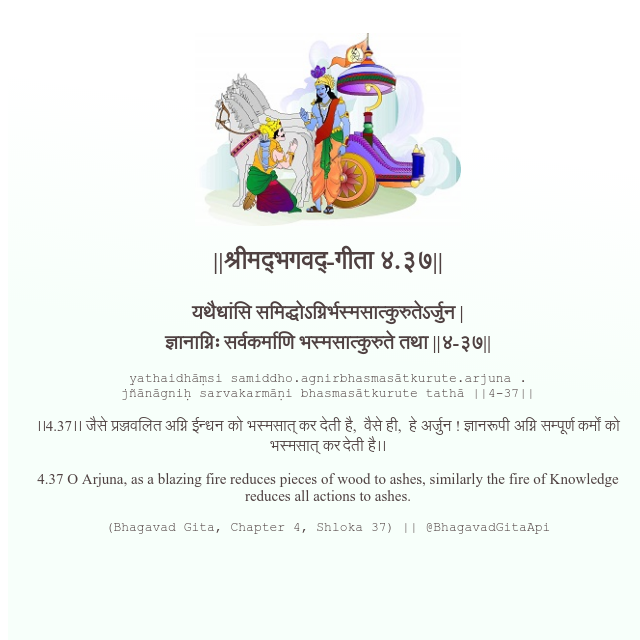

<h2>||श्रीमद्‍भगवद्‍-गीता ४.३७||</h2>
<h3>यथैधांसि समिद्धोऽग्निर्भस्मसात्कुरुतेऽर्जुन | ज्ञानाग्निः सर्वकर्माणि भस्मसात्कुरुते तथा ||४-३७||</h3>
<pre>yathaidhāṃsi samiddho.agnirbhasmasātkurute.arjuna . jñānāgniḥ sarvakarmāṇi bhasmasātkurute tathā ||4-37||</pre>

।।4.37।। जैसे प्रज्जवलित अग्नि ईन्धन को भस्मसात् कर देती है,  वैसे ही,  हे अर्जुन ! ज्ञानरूपी अग्नि सम्पूर्ण कर्मों को भस्मसात् कर देती है।।

<pre>(Bhagavad Gita, Chapter 4, Shloka 37) || @BhagavadGitaApi</pre>
https://vedicscriptures.github.io/

#API #bhagavadgitaapi #slok #nodejs #js #api #gitaapi #krishna #hinduism #vedic #ISKCON #shreemadbhagavadgita #technology

