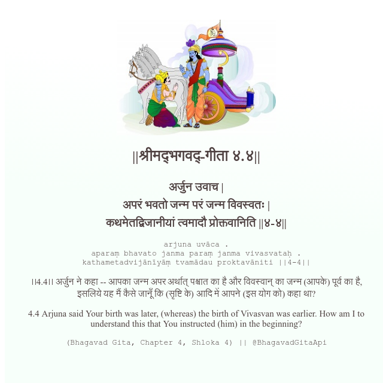

<h2>||श्रीमद्‍भगवद्‍-गीता ४.४||</h2>
<h3>अर्जुन उवाच | अपरं भवतो जन्म परं जन्म विवस्वतः | कथमेतद्विजानीयां त्वमादौ प्रोक्तवानिति ||४-४||</h3>
<pre>arjuna uvāca . aparaṃ bhavato janma paraṃ janma vivasvataḥ . kathametadvijānīyāṃ tvamādau proktavāniti ||4-4||</pre>

।।4.4।। अर्जुन ने कहा -- आपका जन्म अपर अर्थात् पश्चात का है और विवस्वान् का जन्म (आपके) पूर्व का है, इसलिये यह मैं कैसे जानूँ कि (सृष्टि के) आदि में आपने (इस योग को) कहा था?

<pre>(Bhagavad Gita, Chapter 4, Shloka 4) || @BhagavadGitaApi</pre>
https://docs.bhagavadgitaapi.in/

#API #bhagavadgitaapi #slok #nodejs #js #api #gitaapi #krishna #hinduism #vedic #ISKCON #shreemadbhagavadgita #technology

