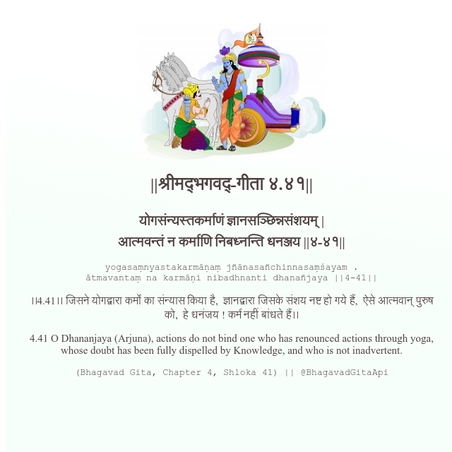

<h2>||श्रीमद्‍भगवद्‍-गीता ४.४१||</h2>
<h3>योगसंन्यस्तकर्माणं ज्ञानसञ्छिन्नसंशयम् | आत्मवन्तं न कर्माणि निबध्नन्ति धनञ्जय ||४-४१||</h3>
<pre>yogasaṃnyastakarmāṇaṃ jñānasañchinnasaṃśayam . ātmavantaṃ na karmāṇi nibadhnanti dhanañjaya ||4-41||</pre>

।।4.41।। जिसने योगद्वारा कर्मों का संन्यास किया है,  ज्ञानद्वारा जिसके संशय नष्ट हो गये हैं,  ऐसे आत्मवान् पुरुष को,  हे धनंजय ! कर्म नहीं बांधते हैं।।

<pre>(Bhagavad Gita, Chapter 4, Shloka 41) || @BhagavadGitaApi</pre>
https://vedicscriptures.github.io/

#API #bhagavadgitaapi #slok #nodejs #js #api #gitaapi #krishna #hinduism #vedic #ISKCON #shreemadbhagavadgita #technology

