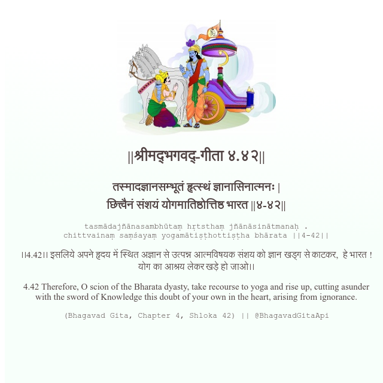

<h2>||श्रीमद्‍भगवद्‍-गीता ४.४२||</h2>
<h3>तस्मादज्ञानसम्भूतं हृत्स्थं ज्ञानासिनात्मनः | छित्त्वैनं संशयं योगमातिष्ठोत्तिष्ठ भारत ||४-४२||</h3>
<pre>tasmādajñānasambhūtaṃ hṛtsthaṃ jñānāsinātmanaḥ . chittvainaṃ saṃśayaṃ yogamātiṣṭhottiṣṭha bhārata ||4-42||</pre>

।।4.42।। इसलिये अपने हृदय में स्थित अज्ञान से उत्पन्न आत्मविषयक संशय को ज्ञान खड्ग से काटकर,  हे भारत ! योग का आश्रय लेकर खड़े हो जाओ।।

<pre>(Bhagavad Gita, Chapter 4, Shloka 42) || @BhagavadGitaApi</pre>
https://docs.bhagavadgitaapi.in/

#API #bhagavadgitaapi #slok #nodejs #js #api #gitaapi #krishna #hinduism #vedic #ISKCON #shreemadbhagavadgita #technology

