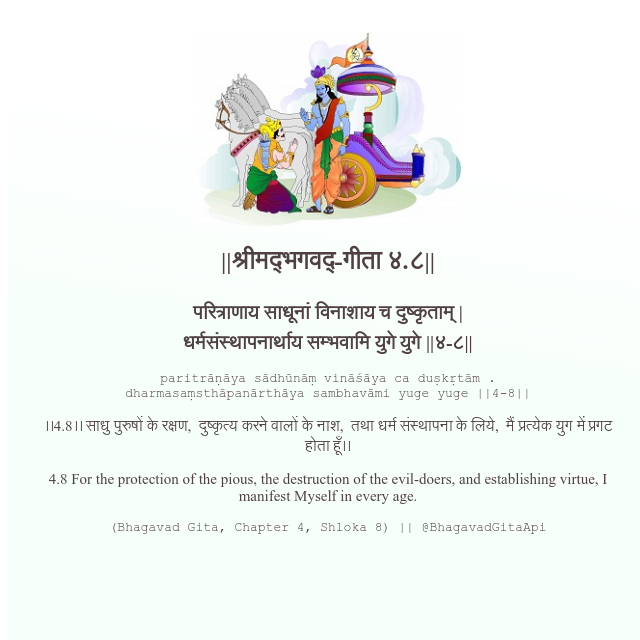

<h2>||श्रीमद्‍भगवद्‍-गीता ४.८||</h2>
<h3>परित्राणाय साधूनां विनाशाय च दुष्कृताम् | धर्मसंस्थापनार्थाय सम्भवामि युगे युगे ||४-८||</h3>
<pre>paritrāṇāya sādhūnāṃ vināśāya ca duṣkṛtām . dharmasaṃsthāpanārthāya sambhavāmi yuge yuge ||4-8||</pre>

।।4.8।। साधु पुरुषों के रक्षण,  दुष्कृत्य करने वालों के नाश,  तथा धर्म संस्थापना के लिये,  मैं प्रत्येक युग में प्रगट होता हूँ।।

<pre>(Bhagavad Gita, Chapter 4, Shloka 8) || @BhagavadGitaApi</pre>
https://bhagavadgitaapi.in/

#API #bhagavadgitaapi #slok #nodejs #js #api #gitaapi #krishna #hinduism #vedic #ISKCON #shreemadbhagavadgita #technology

