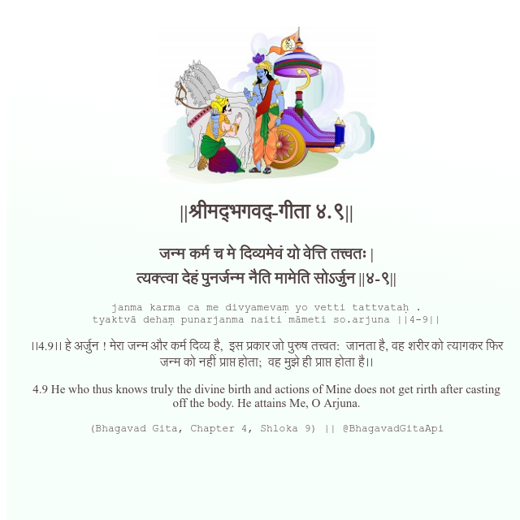

<h2>||श्रीमद्‍भगवद्‍-गीता ४.९||</h2>
<h3>जन्म कर्म च मे दिव्यमेवं यो वेत्ति तत्त्वतः | त्यक्त्वा देहं पुनर्जन्म नैति मामेति सोऽर्जुन ||४-९||</h3>
<pre>janma karma ca me divyamevaṃ yo vetti tattvataḥ . tyaktvā dehaṃ punarjanma naiti māmeti so.arjuna ||4-9||</pre>

।।4.9।। हे अर्जुन ! मेरा जन्म और कर्म दिव्य है,  इस प्रकार जो पुरुष तत्त्वत:  जानता है, वह शरीर को त्यागकर फिर जन्म को नहीं प्राप्त होता;  वह मुझे ही प्राप्त होता है।।

<pre>(Bhagavad Gita, Chapter 4, Shloka 9) || @BhagavadGitaApi</pre>
https://docs.bhagavadgitaapi.in/

#API #bhagavadgitaapi #slok #nodejs #js #api #gitaapi #krishna #hinduism #vedic #ISKCON #shreemadbhagavadgita #technology

