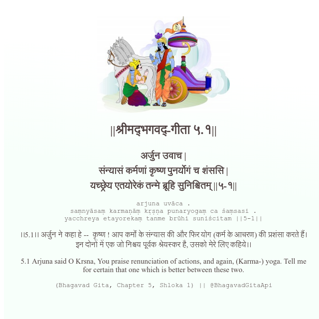

<h2>||श्रीमद्‍भगवद्‍-गीता ५.१||</h2>
<h3>अर्जुन उवाच | संन्यासं कर्मणां कृष्ण पुनर्योगं च शंससि | यच्छ्रेय एतयोरेकं तन्मे ब्रूहि सुनिश्चितम् ||५-१||</h3>
<pre>arjuna uvāca . saṃnyāsaṃ karmaṇāṃ kṛṣṇa punaryogaṃ ca śaṃsasi . yacchreya etayorekaṃ tanme brūhi suniścitam ||5-1||</pre>

।।5.1।। अर्जुन ने कहा हे --  कृष्ण ! आप कर्मों के संन्यास की और फिर योग (कर्म के आचरण) की प्रशंसा करते हैं। इन दोनों में एक जो निश्चय पूर्वक श्रेयस्कर है, उसको मेरे लिए कहिये।।

<pre>(Bhagavad Gita, Chapter 5, Shloka 1) || @BhagavadGitaApi</pre>
https://vedicscriptures.github.io/

#API #bhagavadgitaapi #slok #nodejs #js #api #gitaapi #krishna #hinduism #vedic #ISKCON #shreemadbhagavadgita #technology

