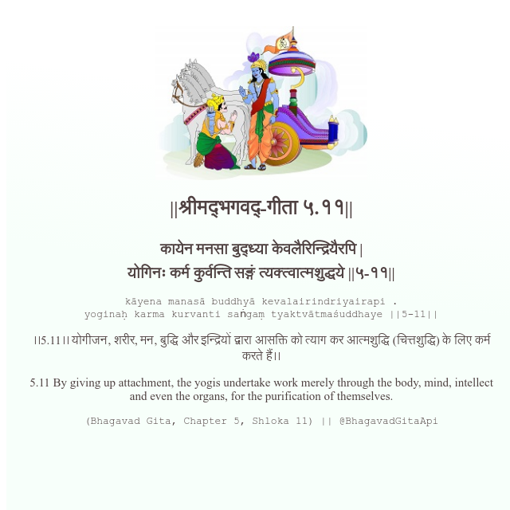

<h2>||श्रीमद्‍भगवद्‍-गीता ५.११||</h2>
<h3>कायेन मनसा बुद्ध्या केवलैरिन्द्रियैरपि | योगिनः कर्म कुर्वन्ति सङ्गं त्यक्त्वात्मशुद्धये ||५-११||</h3>
<pre>kāyena manasā buddhyā kevalairindriyairapi . yoginaḥ karma kurvanti saṅgaṃ tyaktvātmaśuddhaye ||5-11||</pre>

।।5.11।। योगीजन, शरीर, मन, बुद्धि और इन्द्रियों द्वारा आसक्ति को त्याग कर आत्मशुद्धि (चित्तशुद्धि) के लिए कर्म करते हैं।।

<pre>(Bhagavad Gita, Chapter 5, Shloka 11) || @BhagavadGitaApi</pre>
https://vedicscriptures.github.io/

#API #bhagavadgitaapi #slok #nodejs #js #api #gitaapi #krishna #hinduism #vedic #ISKCON #shreemadbhagavadgita #technology

