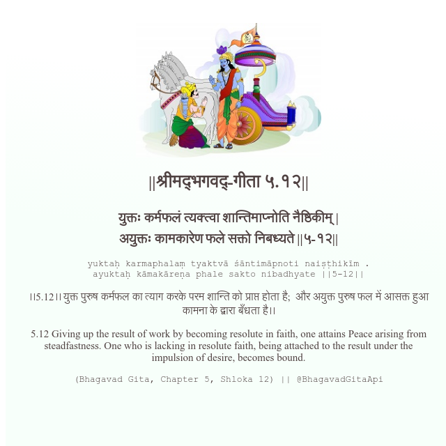

<h2>||श्रीमद्‍भगवद्‍-गीता ५.१२||</h2>
<h3>युक्तः कर्मफलं त्यक्त्वा शान्तिमाप्नोति नैष्ठिकीम् | अयुक्तः कामकारेण फले सक्तो निबध्यते ||५-१२||</h3>
<pre>yuktaḥ karmaphalaṃ tyaktvā śāntimāpnoti naiṣṭhikīm . ayuktaḥ kāmakāreṇa phale sakto nibadhyate ||5-12||</pre>

।।5.12।। युक्त पुरुष कर्मफल का त्याग करके परम शान्ति को प्राप्त होता है;  और अयुक्त पुरुष फल में आसक्त हुआ कामना के द्वारा बँधता है।।

<pre>(Bhagavad Gita, Chapter 5, Shloka 12) || @BhagavadGitaApi</pre>
https://vedicscriptures.github.io/

#API #bhagavadgitaapi #slok #nodejs #js #api #gitaapi #krishna #hinduism #vedic #ISKCON #shreemadbhagavadgita #technology

