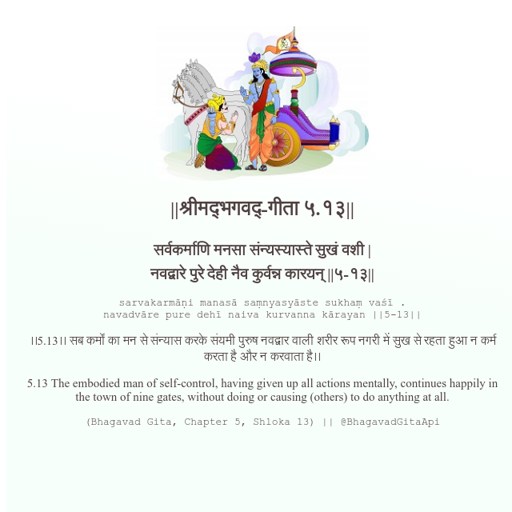

<h2>||श्रीमद्‍भगवद्‍-गीता ५.१३||</h2>
<h3>सर्वकर्माणि मनसा संन्यस्यास्ते सुखं वशी | नवद्वारे पुरे देही नैव कुर्वन्न कारयन् ||५-१३||</h3>
<pre>sarvakarmāṇi manasā saṃnyasyāste sukhaṃ vaśī . navadvāre pure dehī naiva kurvanna kārayan ||5-13||</pre>

।।5.13।। सब कर्मों का मन से संन्यास करके संयमी पुरुष नवद्वार वाली शरीर रूप नगरी में सुख से रहता हुआ न कर्म करता है और न करवाता है।।

<pre>(Bhagavad Gita, Chapter 5, Shloka 13) || @BhagavadGitaApi</pre>
https://bhagavadgitaapi.in/

#API #bhagavadgitaapi #slok #nodejs #js #api #gitaapi #krishna #hinduism #vedic #ISKCON #shreemadbhagavadgita #technology

