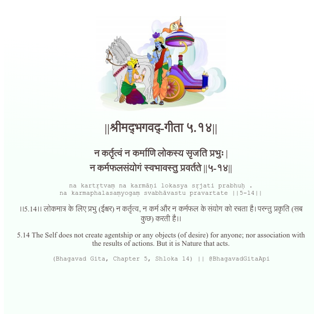

<h2>||श्रीमद्‍भगवद्‍-गीता ५.१४||</h2>
<h3>न कर्तृत्वं न कर्माणि लोकस्य सृजति प्रभुः | न कर्मफलसंयोगं स्वभावस्तु प्रवर्तते ||५-१४||</h3>
<pre>na kartṛtvaṃ na karmāṇi lokasya sṛjati prabhuḥ . na karmaphalasaṃyogaṃ svabhāvastu pravartate ||5-14||</pre>

।।5.14।। लोकमात्र के लिए प्रभु (ईश्वर) न कर्तृत्व, न कर्म और न कर्मफल के संयोग को रचता है। परन्तु प्रकृति (सब कुछ) करती है।।

<pre>(Bhagavad Gita, Chapter 5, Shloka 14) || @BhagavadGitaApi</pre>
https://bhagavadgitaapi.in/

#API #bhagavadgitaapi #slok #nodejs #js #api #gitaapi #krishna #hinduism #vedic #ISKCON #shreemadbhagavadgita #technology

