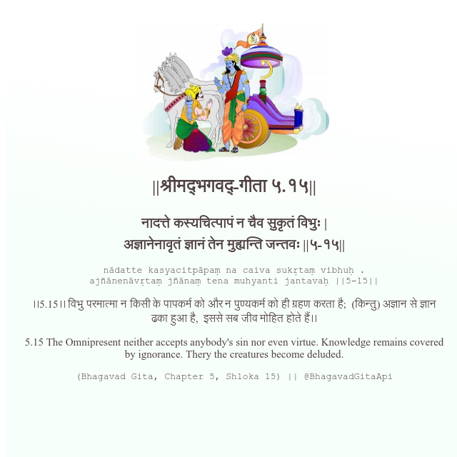

<h2>||श्रीमद्‍भगवद्‍-गीता ५.१५||</h2>
<h3>नादत्ते कस्यचित्पापं न चैव सुकृतं विभुः | अज्ञानेनावृतं ज्ञानं तेन मुह्यन्ति जन्तवः ||५-१५||</h3>
<pre>nādatte kasyacitpāpaṃ na caiva sukṛtaṃ vibhuḥ . ajñānenāvṛtaṃ jñānaṃ tena muhyanti jantavaḥ ||5-15||</pre>

।।5.15।। विभु परमात्मा न किसी के पापकर्म को और न पुण्यकर्म को ही ग्रहण करता है;  (किन्तु) अज्ञान से ज्ञान ढका हुआ है,  इससे सब जीव मोहित होते हैं।।

<pre>(Bhagavad Gita, Chapter 5, Shloka 15) || @BhagavadGitaApi</pre>
https://docs.bhagavadgitaapi.in/

#API #bhagavadgitaapi #slok #nodejs #js #api #gitaapi #krishna #hinduism #vedic #ISKCON #shreemadbhagavadgita #technology

