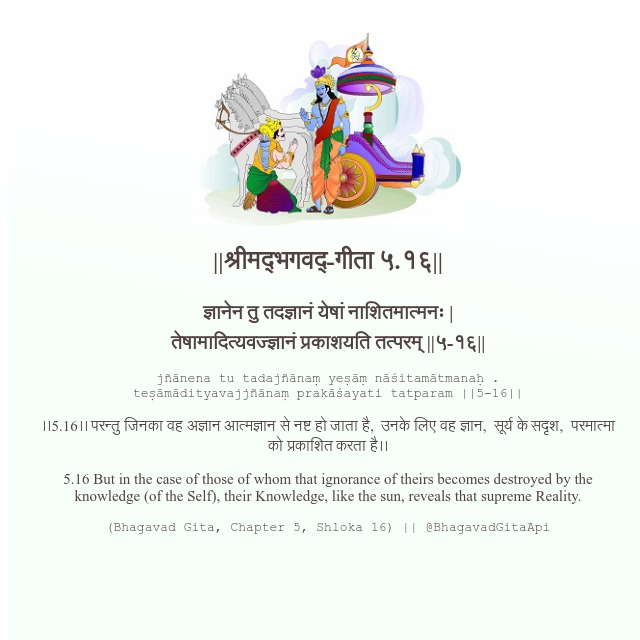

<h2>||श्रीमद्‍भगवद्‍-गीता ५.१६||</h2>
<h3>ज्ञानेन तु तदज्ञानं येषां नाशितमात्मनः | तेषामादित्यवज्ज्ञानं प्रकाशयति तत्परम् ||५-१६||</h3>
<pre>jñānena tu tadajñānaṃ yeṣāṃ nāśitamātmanaḥ . teṣāmādityavajjñānaṃ prakāśayati tatparam ||5-16||</pre>

।।5.16।। परन्तु जिनका वह अज्ञान आत्मज्ञान से नष्ट हो जाता है,  उनके लिए वह ज्ञान,  सूर्य के सदृश,  परमात्मा को प्रकाशित करता है।।

<pre>(Bhagavad Gita, Chapter 5, Shloka 16) || @BhagavadGitaApi</pre>
https://docs.bhagavadgitaapi.in/

#API #bhagavadgitaapi #slok #nodejs #js #api #gitaapi #krishna #hinduism #vedic #ISKCON #shreemadbhagavadgita #technology

