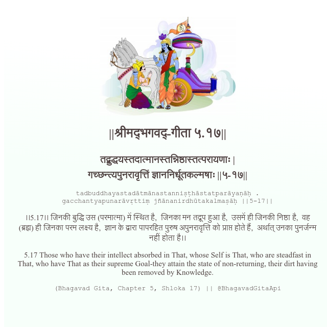

<h2>||श्रीमद्‍भगवद्‍-गीता ५.१७||</h2>
<h3>तद्बुद्धयस्तदात्मानस्तन्निष्ठास्तत्परायणाः | गच्छन्त्यपुनरावृत्तिं ज्ञाननिर्धूतकल्मषाः ||५-१७||</h3>
<pre>tadbuddhayastadātmānastanniṣṭhāstatparāyaṇāḥ . gacchantyapunarāvṛttiṃ jñānanirdhūtakalmaṣāḥ ||5-17||</pre>

।।5.17।। जिनकी बुद्धि उस (परमात्मा) में स्थित है,  जिनका मन तद्रूप हुआ है,  उसमें ही जिनकी निष्ठा है,  वह (ब्रह्म) ही जिनका परम लक्ष्य है,  ज्ञान के द्वारा पापरहित पुरुष अपुनरावृत्ति को प्राप्त होते हैं,  अर्थात् उनका पुनर्जन्म नहीं होता है।।

<pre>(Bhagavad Gita, Chapter 5, Shloka 17) || @BhagavadGitaApi</pre>
https://docs.bhagavadgitaapi.in/

#API #bhagavadgitaapi #slok #nodejs #js #api #gitaapi #krishna #hinduism #vedic #ISKCON #shreemadbhagavadgita #technology

