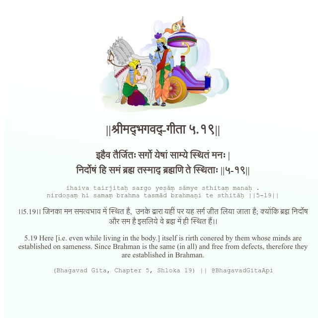

<h2>||श्रीमद्‍भगवद्‍-गीता ५.१९||</h2>
<h3>इहैव तैर्जितः सर्गो येषां साम्ये स्थितं मनः | निर्दोषं हि समं ब्रह्म तस्माद् ब्रह्मणि ते स्थिताः ||५-१९||</h3>
<pre>ihaiva tairjitaḥ sargo yeṣāṃ sāmye sthitaṃ manaḥ . nirdoṣaṃ hi samaṃ brahma tasmād brahmaṇi te sthitāḥ ||5-19||</pre>

।।5.19।। जिनका मन समत्वभाव में स्थित है,  उनके द्वारा यहीं पर यह सर्ग जीत लिया जाता है; क्योंकि ब्रह्म निर्दोष और सम है इसलिये वे ब्रह्म में ही स्थित हैं।।

<pre>(Bhagavad Gita, Chapter 5, Shloka 19) || @BhagavadGitaApi</pre>
https://bhagavadgitaapi.in/

#API #bhagavadgitaapi #slok #nodejs #js #api #gitaapi #krishna #hinduism #vedic #ISKCON #shreemadbhagavadgita #technology

