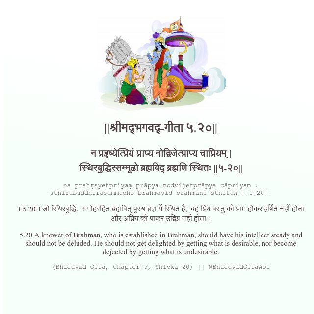

<h2>||श्रीमद्‍भगवद्‍-गीता ५.२०||</h2>
<h3>न प्रहृष्येत्प्रियं प्राप्य नोद्विजेत्प्राप्य चाप्रियम् | स्थिरबुद्धिरसम्मूढो ब्रह्मविद् ब्रह्मणि स्थितः ||५-२०||</h3>
<pre>na prahṛṣyetpriyaṃ prāpya nodvijetprāpya cāpriyam . sthirabuddhirasammūḍho brahmavid brahmaṇi sthitaḥ ||5-20||</pre>

।।5.20।। जो स्थिरबुद्धि,  संमोहरहित ब्रह्मवित् पुरुष ब्रह्म में स्थित है,  वह प्रिय वस्तु को प्राप्त होकर हर्षित नहीं होता और अप्रिय को पाकर उद्विग्न नहीं होता।।

<pre>(Bhagavad Gita, Chapter 5, Shloka 20) || @BhagavadGitaApi</pre>
https://vedicscriptures.github.io/

#API #bhagavadgitaapi #slok #nodejs #js #api #gitaapi #krishna #hinduism #vedic #ISKCON #shreemadbhagavadgita #technology

