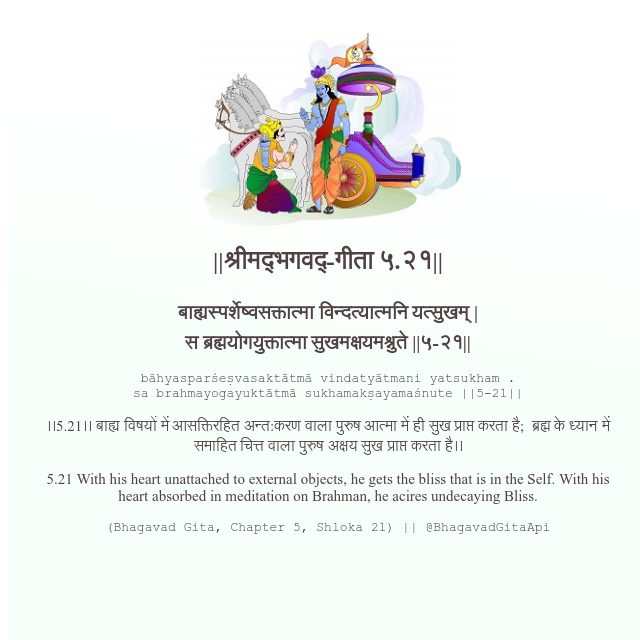

<h2>||श्रीमद्‍भगवद्‍-गीता ५.२१||</h2>
<h3>बाह्यस्पर्शेष्वसक्तात्मा विन्दत्यात्मनि यत्सुखम् | स ब्रह्मयोगयुक्तात्मा सुखमक्षयमश्नुते ||५-२१||</h3>
<pre>bāhyasparśeṣvasaktātmā vindatyātmani yatsukham . sa brahmayogayuktātmā sukhamakṣayamaśnute ||5-21||</pre>

।।5.21।। बाह्य विषयों में आसक्तिरहित अन्त:करण वाला पुरुष आत्मा में ही सुख प्राप्त करता है;  ब्रह्म के ध्यान में समाहित चित्त वाला पुरुष अक्षय सुख प्राप्त करता है।।

<pre>(Bhagavad Gita, Chapter 5, Shloka 21) || @BhagavadGitaApi</pre>
https://docs.bhagavadgitaapi.in/

#API #bhagavadgitaapi #slok #nodejs #js #api #gitaapi #krishna #hinduism #vedic #ISKCON #shreemadbhagavadgita #technology

