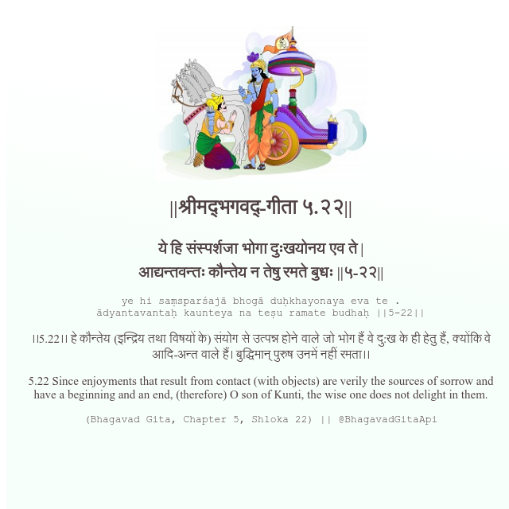

<h2>||श्रीमद्‍भगवद्‍-गीता ५.२२||</h2>
<h3>ये हि संस्पर्शजा भोगा दुःखयोनय एव ते | आद्यन्तवन्तः कौन्तेय न तेषु रमते बुधः ||५-२२||</h3>
<pre>ye hi saṃsparśajā bhogā duḥkhayonaya eva te . ādyantavantaḥ kaunteya na teṣu ramate budhaḥ ||5-22||</pre>

।।5.22।। हे कौन्तेय (इन्द्रिय तथा विषयों के) संयोग से उत्पन्न होने वाले जो भोग हैं वे दु:ख के ही हेतु हैं, क्योंकि वे आदि-अन्त वाले हैं। बुद्धिमान् पुरुष उनमें नहीं रमता।।

<pre>(Bhagavad Gita, Chapter 5, Shloka 22) || @BhagavadGitaApi</pre>
https://vedicscriptures.github.io/

#API #bhagavadgitaapi #slok #nodejs #js #api #gitaapi #krishna #hinduism #vedic #ISKCON #shreemadbhagavadgita #technology

