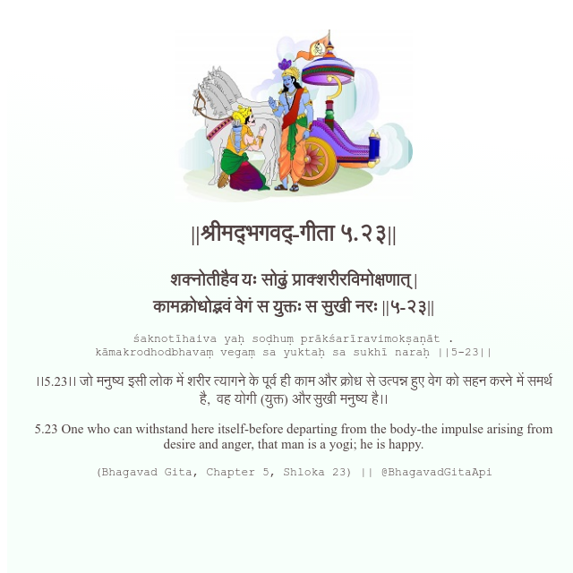

<h2>||श्रीमद्‍भगवद्‍-गीता ५.२३||</h2>
<h3>शक्नोतीहैव यः सोढुं प्राक्शरीरविमोक्षणात् | कामक्रोधोद्भवं वेगं स युक्तः स सुखी नरः ||५-२३||</h3>
<pre>śaknotīhaiva yaḥ soḍhuṃ prākśarīravimokṣaṇāt . kāmakrodhodbhavaṃ vegaṃ sa yuktaḥ sa sukhī naraḥ ||5-23||</pre>

।।5.23।। जो मनुष्य इसी लोक में शरीर त्यागने के पूर्व ही काम और क्रोध से उत्पन्न हुए वेग को सहन करने में समर्थ है,  वह योगी (युक्त) और सुखी मनुष्य है।।

<pre>(Bhagavad Gita, Chapter 5, Shloka 23) || @BhagavadGitaApi</pre>
https://bhagavadgitaapi.in/

#API #bhagavadgitaapi #slok #nodejs #js #api #gitaapi #krishna #hinduism #vedic #ISKCON #shreemadbhagavadgita #technology

