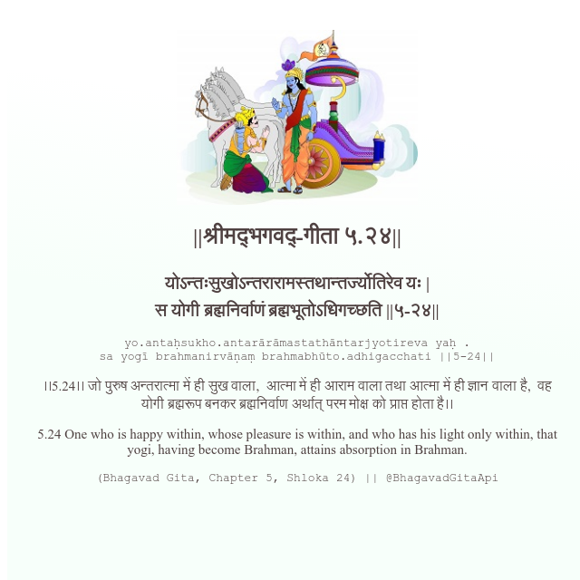

<h2>||श्रीमद्‍भगवद्‍-गीता ५.२४||</h2>
<h3>योऽन्तःसुखोऽन्तरारामस्तथान्तर्ज्योतिरेव यः | स योगी ब्रह्मनिर्वाणं ब्रह्मभूतोऽधिगच्छति ||५-२४||</h3>
<pre>yo.antaḥsukho.antarārāmastathāntarjyotireva yaḥ . sa yogī brahmanirvāṇaṃ brahmabhūto.adhigacchati ||5-24||</pre>

।।5.24।। जो पुरुष अन्तरात्मा में ही सुख वाला,  आत्मा में ही आराम वाला तथा आत्मा में ही ज्ञान वाला है,  वह योगी ब्रह्मरूप बनकर ब्रह्मनिर्वाण अर्थात् परम मोक्ष को प्राप्त होता है।।

<pre>(Bhagavad Gita, Chapter 5, Shloka 24) || @BhagavadGitaApi</pre>
https://vedicscriptures.github.io/

#API #bhagavadgitaapi #slok #nodejs #js #api #gitaapi #krishna #hinduism #vedic #ISKCON #shreemadbhagavadgita #technology

