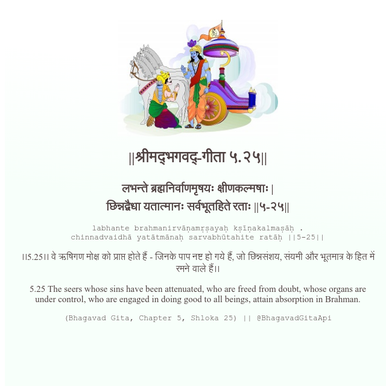

<h2>||श्रीमद्‍भगवद्‍-गीता ५.२५||</h2>
<h3>लभन्ते ब्रह्मनिर्वाणमृषयः क्षीणकल्मषाः | छिन्नद्वैधा यतात्मानः सर्वभूतहिते रताः ||५-२५||</h3>
<pre>labhante brahmanirvāṇamṛṣayaḥ kṣīṇakalmaṣāḥ . chinnadvaidhā yatātmānaḥ sarvabhūtahite ratāḥ ||5-25||</pre>

।।5.25।। वे ऋषिगण मोक्ष को प्राप्त होते हैं - जिनके पाप नष्ट हो गये हैं, जो छिन्नसंशय, संयमी और भूतमात्र के हित में रमने वाले हैं।।

<pre>(Bhagavad Gita, Chapter 5, Shloka 25) || @BhagavadGitaApi</pre>
https://docs.bhagavadgitaapi.in/

#API #bhagavadgitaapi #slok #nodejs #js #api #gitaapi #krishna #hinduism #vedic #ISKCON #shreemadbhagavadgita #technology

