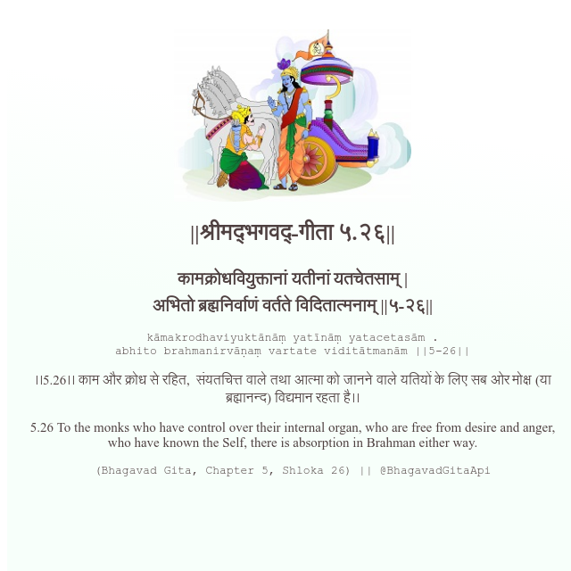

<h2>||श्रीमद्‍भगवद्‍-गीता ५.२६||</h2>
<h3>कामक्रोधवियुक्तानां यतीनां यतचेतसाम् | अभितो ब्रह्मनिर्वाणं वर्तते विदितात्मनाम् ||५-२६||</h3>
<pre>kāmakrodhaviyuktānāṃ yatīnāṃ yatacetasām . abhito brahmanirvāṇaṃ vartate viditātmanām ||5-26||</pre>

।।5.26।। काम और क्रोध से रहित,  संयतचित्त वाले तथा आत्मा को जानने वाले यतियों के लिए सब ओर मोक्ष (या ब्रह्मानन्द) विद्यमान रहता है।।

<pre>(Bhagavad Gita, Chapter 5, Shloka 26) || @BhagavadGitaApi</pre>
https://vedicscriptures.github.io/

#API #bhagavadgitaapi #slok #nodejs #js #api #gitaapi #krishna #hinduism #vedic #ISKCON #shreemadbhagavadgita #technology

