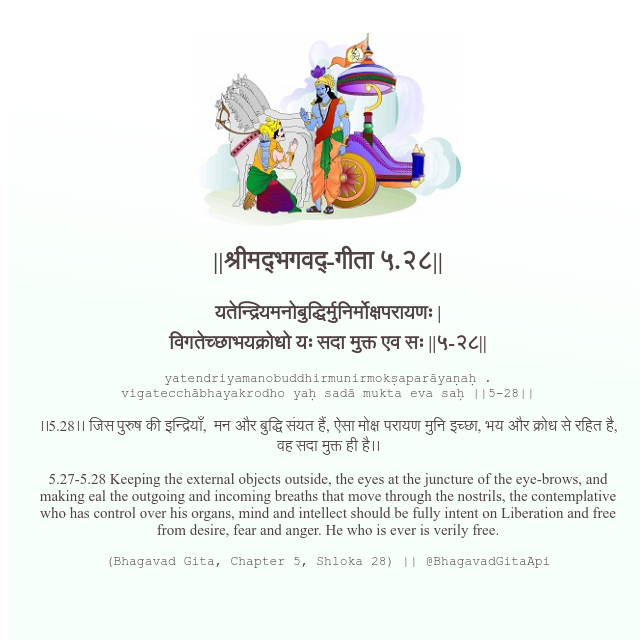

<h2>||श्रीमद्‍भगवद्‍-गीता ५.२८||</h2>
<h3>यतेन्द्रियमनोबुद्धिर्मुनिर्मोक्षपरायणः | विगतेच्छाभयक्रोधो यः सदा मुक्त एव सः ||५-२८||</h3>
<pre>yatendriyamanobuddhirmunirmokṣaparāyaṇaḥ . vigatecchābhayakrodho yaḥ sadā mukta eva saḥ ||5-28||</pre>

।।5.28।। जिस पुरुष की इन्द्रियाँ,  मन और बुद्धि संयत हैं, ऐसा मोक्ष परायण मुनि इच्छा, भय और क्रोध से रहित है, वह सदा मुक्त ही है।।

<pre>(Bhagavad Gita, Chapter 5, Shloka 28) || @BhagavadGitaApi</pre>
https://bhagavadgitaapi.in/

#API #bhagavadgitaapi #slok #nodejs #js #api #gitaapi #krishna #hinduism #vedic #ISKCON #shreemadbhagavadgita #technology

