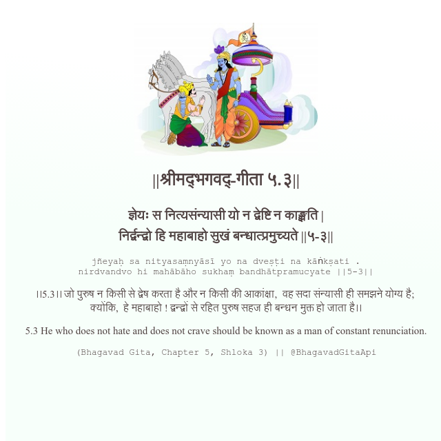

<h2>||श्रीमद्‍भगवद्‍-गीता ५.३||</h2>
<h3>ज्ञेयः स नित्यसंन्यासी यो न द्वेष्टि न काङ्क्षति | निर्द्वन्द्वो हि महाबाहो सुखं बन्धात्प्रमुच्यते ||५-३||</h3>
<pre>jñeyaḥ sa nityasaṃnyāsī yo na dveṣṭi na kāṅkṣati . nirdvandvo hi mahābāho sukhaṃ bandhātpramucyate ||5-3||</pre>

।।5.3।। जो पुरुष न किसी से द्वेष करता है और न किसी की आकांक्षा,  वह सदा संन्यासी ही समझने योग्य है;  क्योंकि,  हे महाबाहो ! द्वन्द्वों से रहित पुरुष सहज ही बन्धन मुक्त हो जाता है।।

<pre>(Bhagavad Gita, Chapter 5, Shloka 3) || @BhagavadGitaApi</pre>
https://bhagavadgitaapi.in/

#API #bhagavadgitaapi #slok #nodejs #js #api #gitaapi #krishna #hinduism #vedic #ISKCON #shreemadbhagavadgita #technology

