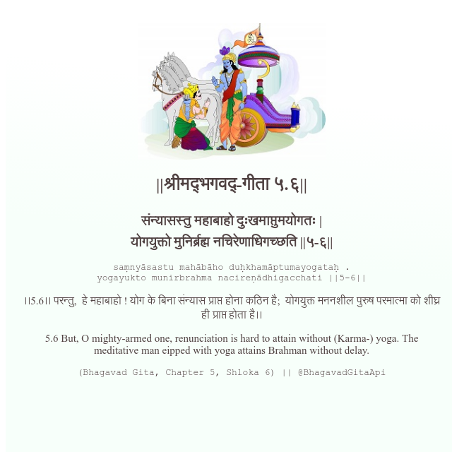

<h2>||श्रीमद्‍भगवद्‍-गीता ५.६||</h2>
<h3>संन्यासस्तु महाबाहो दुःखमाप्तुमयोगतः | योगयुक्तो मुनिर्ब्रह्म नचिरेणाधिगच्छति ||५-६||</h3>
<pre>saṃnyāsastu mahābāho duḥkhamāptumayogataḥ . yogayukto munirbrahma nacireṇādhigacchati ||5-6||</pre>

।।5.6।। परन्तु,  हे महाबाहो ! योग के बिना संन्यास प्राप्त होना कठिन है;  योगयुक्त मननशील पुरुष परमात्मा को शीघ्र ही प्राप्त होता है।।

<pre>(Bhagavad Gita, Chapter 5, Shloka 6) || @BhagavadGitaApi</pre>
https://docs.bhagavadgitaapi.in/

#API #bhagavadgitaapi #slok #nodejs #js #api #gitaapi #krishna #hinduism #vedic #ISKCON #shreemadbhagavadgita #technology

