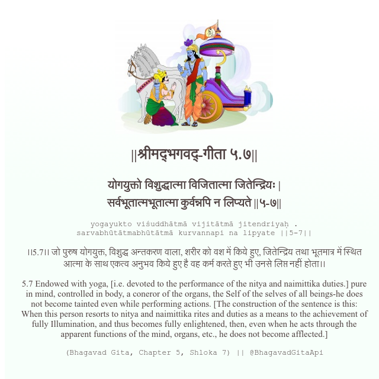

<h2>||श्रीमद्‍भगवद्‍-गीता ५.७||</h2>
<h3>योगयुक्तो विशुद्धात्मा विजितात्मा जितेन्द्रियः | सर्वभूतात्मभूतात्मा कुर्वन्नपि न लिप्यते ||५-७||</h3>
<pre>yogayukto viśuddhātmā vijitātmā jitendriyaḥ . sarvabhūtātmabhūtātmā kurvannapi na lipyate ||5-7||</pre>

।।5.7।। जो पुरुष योगयुक्त, विशुद्ध अन्तकरण वाला, शरीर को वश में किये हुए, जितेन्द्रिय तथा भूतमात्र में स्थित आत्मा के साथ एकत्व अनुभव किये हुए है वह कर्म करते हुए भी उनसे लिप्त नहीं होता।।

<pre>(Bhagavad Gita, Chapter 5, Shloka 7) || @BhagavadGitaApi</pre>
https://bhagavadgitaapi.in/

#API #bhagavadgitaapi #slok #nodejs #js #api #gitaapi #krishna #hinduism #vedic #ISKCON #shreemadbhagavadgita #technology

