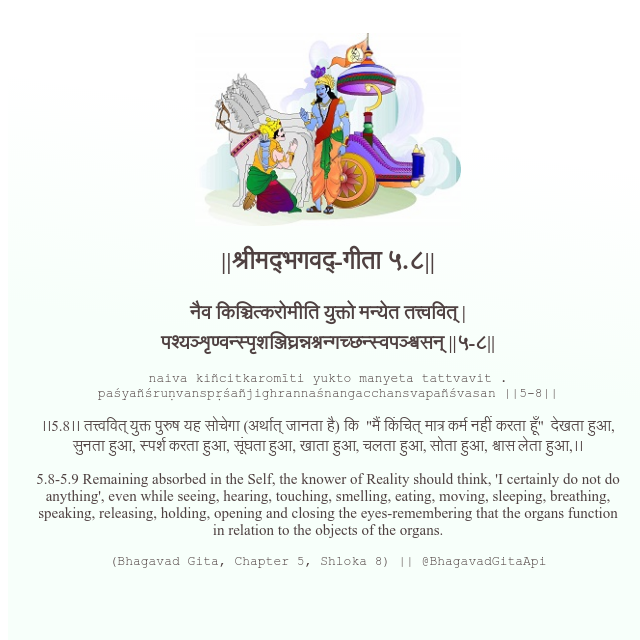

<h2>||श्रीमद्‍भगवद्‍-गीता ५.८||</h2>
<h3>नैव किञ्चित्करोमीति युक्तो मन्येत तत्त्ववित् | पश्यञ्शृण्वन्स्पृशञ्जिघ्रन्नश्नन्गच्छन्स्वपञ्श्वसन् ||५-८||</h3>
<pre>naiva kiñcitkaromīti yukto manyeta tattvavit . paśyañśruṇvanspṛśañjighrannaśnangacchansvapañśvasan ||5-8||</pre>

।।5.8।। तत्त्ववित् युक्त पुरुष यह सोचेगा (अर्थात् जानता है) कि  "मैं किंचित् मात्र कर्म नहीं करता हूँ"  देखता हुआ, सुनता हुआ, स्पर्श करता हुआ, सूंघता हुआ, खाता हुआ, चलता हुआ, सोता हुआ, श्वास लेता हुआ,।।

<pre>(Bhagavad Gita, Chapter 5, Shloka 8) || @BhagavadGitaApi</pre>
https://docs.bhagavadgitaapi.in/

#API #bhagavadgitaapi #slok #nodejs #js #api #gitaapi #krishna #hinduism #vedic #ISKCON #shreemadbhagavadgita #technology

