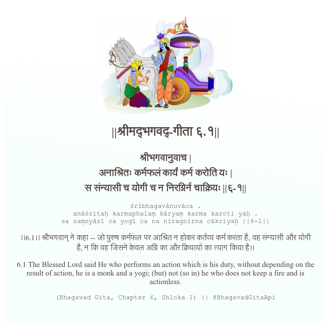

<h2>||श्रीमद्‍भगवद्‍-गीता ६.१||</h2>
<h3>श्रीभगवानुवाच | अनाश्रितः कर्मफलं कार्यं कर्म करोति यः | स संन्यासी च योगी च न निरग्निर्न चाक्रियः ||६-१||</h3>
<pre>śrībhagavānuvāca . anāśritaḥ karmaphalaṃ kāryaṃ karma karoti yaḥ . sa saṃnyāsī ca yogī ca na niragnirna cākriyaḥ ||6-1||</pre>

।।6.1।। श्रीभगवान् ने कहा -- जो पुरुष कर्मफल पर आश्रित न होकर कर्तव्य कर्म करता है, वह संन्यासी और योगी है, न कि वह जिसने केवल अग्नि का और क्रियायों का त्याग किया है।।

<pre>(Bhagavad Gita, Chapter 6, Shloka 1) || @BhagavadGitaApi</pre>
https://docs.bhagavadgitaapi.in/

#API #bhagavadgitaapi #slok #nodejs #js #api #gitaapi #krishna #hinduism #vedic #ISKCON #shreemadbhagavadgita #technology

