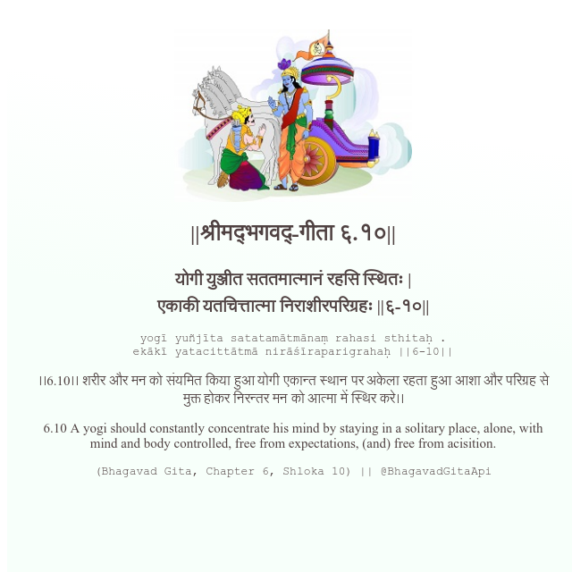

<h2>||श्रीमद्‍भगवद्‍-गीता ६.१०||</h2>
<h3>योगी युञ्जीत सततमात्मानं रहसि स्थितः | एकाकी यतचित्तात्मा निराशीरपरिग्रहः ||६-१०||</h3>
<pre>yogī yuñjīta satatamātmānaṃ rahasi sthitaḥ . ekākī yatacittātmā nirāśīraparigrahaḥ ||6-10||</pre>

।।6.10।। शरीर और मन को संयमित किया हुआ योगी एकान्त स्थान पर अकेला रहता हुआ आशा और परिग्रह से मुक्त होकर निरन्तर मन को आत्मा में स्थिर करे।।

<pre>(Bhagavad Gita, Chapter 6, Shloka 10) || @BhagavadGitaApi</pre>
https://vedicscriptures.github.io/

#API #bhagavadgitaapi #slok #nodejs #js #api #gitaapi #krishna #hinduism #vedic #ISKCON #shreemadbhagavadgita #technology

