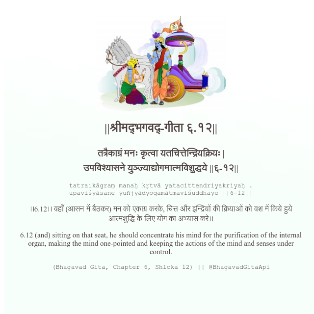

<h2>||श्रीमद्‍भगवद्‍-गीता ६.१२||</h2>
<h3>तत्रैकाग्रं मनः कृत्वा यतचित्तेन्द्रियक्रियः | उपविश्यासने युञ्ज्याद्योगमात्मविशुद्धये ||६-१२||</h3>
<pre>tatraikāgraṃ manaḥ kṛtvā yatacittendriyakriyaḥ . upaviśyāsane yuñjyādyogamātmaviśuddhaye ||6-12||</pre>

।।6.12।। वहाँ (आसन में बैठकर) मन को एकाग्र करके, चित्त और इन्द्रियों की क्रियाओं को वश में किये हुये आत्मशुद्धि के लिए योग का अभ्यास करे।।

<pre>(Bhagavad Gita, Chapter 6, Shloka 12) || @BhagavadGitaApi</pre>
https://bhagavadgitaapi.in/

#API #bhagavadgitaapi #slok #nodejs #js #api #gitaapi #krishna #hinduism #vedic #ISKCON #shreemadbhagavadgita #technology

