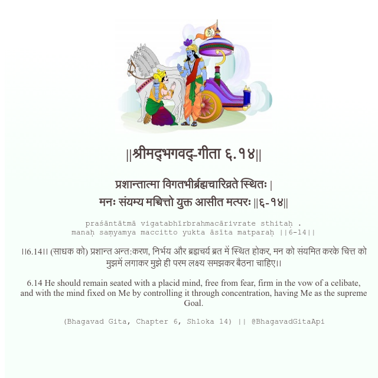

<h2>||श्रीमद्‍भगवद्‍-गीता ६.१४||</h2>
<h3>प्रशान्तात्मा विगतभीर्ब्रह्मचारिव्रते स्थितः | मनः संयम्य मच्चित्तो युक्त आसीत मत्परः ||६-१४||</h3>
<pre>praśāntātmā vigatabhīrbrahmacārivrate sthitaḥ . manaḥ saṃyamya maccitto yukta āsīta matparaḥ ||6-14||</pre>

।।6.14।। (साधक को) प्रशान्त अन्त:करण, निर्भय और ब्रह्मचर्य ब्रत में स्थित होकर, मन को संयमित करके चित्त को मुझमें लगाकर मुझे ही परम लक्ष्य समझकर बैठना चाहिए।।

<pre>(Bhagavad Gita, Chapter 6, Shloka 14) || @BhagavadGitaApi</pre>
https://vedicscriptures.github.io/

#API #bhagavadgitaapi #slok #nodejs #js #api #gitaapi #krishna #hinduism #vedic #ISKCON #shreemadbhagavadgita #technology

